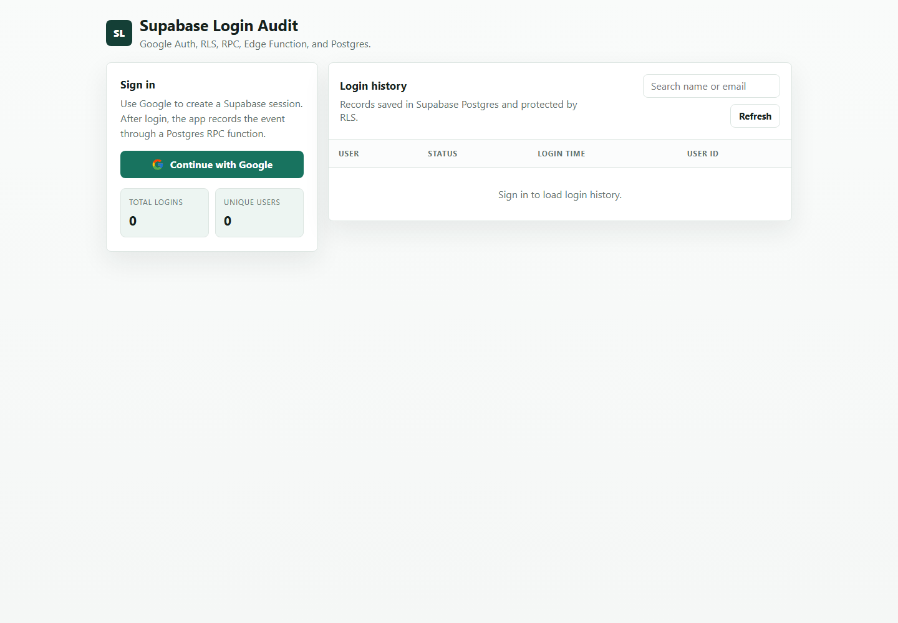
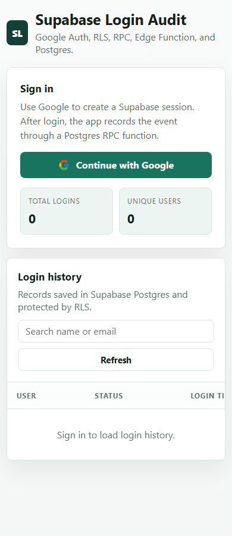
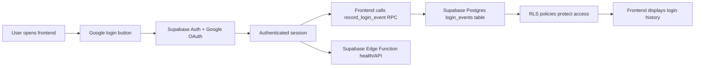

# Supabase Login Audit

A full stack Supabase assessment project that implements Google login, records login events in Supabase Postgres, protects the data with RLS, uses an RPC function for inserts, and includes a Supabase Edge Function.

## Live Links

- Live app: https://supabase-login-audit.netlify.app/
- GitHub repo: https://github.com/dhineshbuilder/supabase-login-audit
- Supabase Edge Function health: https://hzppujksrtwktfmhjoqf.supabase.co/functions/v1/login-app/health

## Screenshots

### Desktop



### Mobile



## Features

- Google OAuth login with Supabase Auth
- Login event recording after successful authentication
- Supabase Postgres table for login history
- Row Level Security policies on the login table
- RPC function `record_login_event()` for safe DB writes
- Frontend table showing user name, email, login time, and user ID
- Search, refresh, logout, total login count, and unique user count
- Supabase Edge Function health/API endpoint
- Netlify and Vercel deployment configuration

## Tech Stack

- Frontend: HTML, CSS, JavaScript
- Auth: Supabase Auth with Google OAuth
- Database: Supabase Postgres
- Security: Supabase Row Level Security
- Backend logic: Supabase RPC / Postgres function
- Serverless: Supabase Edge Function
- Hosting: Netlify
- Deployment config: `netlify.toml`, `vercel.json`

## Architecture Overview



### Data Flow

1. User opens the Netlify frontend.
2. User signs in with Google through Supabase Auth.
3. Supabase returns an authenticated session.
4. Frontend calls the `record_login_event()` RPC function.
5. RPC uses `auth.uid()` and `auth.jwt()` to store the correct user details.
6. Frontend reads `login_events` and displays who logged in and when.

## Project Structure

```text
docs/index.html
  Frontend app hosted on Netlify.

docs/screenshots/
  Project screenshots for README.

supabase/migrations/20260531000000_create_login_events.sql
  Database table, indexes, RLS policies, permissions, and RPC function.

supabase/functions/login-app/index.ts
  Supabase Edge Function health/API endpoint.

supabase/config.toml
  Edge Function config, including public access for the function.

netlify.toml
  Netlify deployment config.

vercel.json
  Vercel deployment config.
```

## Database Schema

Table: `public.login_events`

| Column | Type | Description |
| --- | --- | --- |
| `id` | `uuid` | Primary key |
| `user_id` | `uuid` | Supabase Auth user ID |
| `email` | `text` | User email |
| `full_name` | `text` | Google profile name |
| `avatar_url` | `text` | Google profile image |
| `logged_in_at` | `timestamptz` | Login timestamp |

## RLS and RPC

RLS is enabled on `public.login_events`.

Policies:

- Authenticated users can view login events.
- Authenticated users can insert only their own records.

RPC function:

```sql
public.record_login_event()
```

The frontend does not send a user ID manually. The RPC function uses Supabase Auth helpers:

```sql
auth.uid()
auth.jwt()
```

This prevents users from creating login records for another user.

## Supabase Setup

1. Create a Supabase project.
2. Enable Google provider in `Authentication -> Providers`.
3. Add Google Client ID and Client Secret.
4. Add this Google redirect URI in Google Cloud:

```text
https://<PROJECT_REF>.supabase.co/auth/v1/callback
```

5. Add your frontend URL in Supabase Auth redirect URLs:

```text
https://supabase-login-audit.netlify.app/
```

6. Apply the database migration:

```bash
supabase login
supabase link --project-ref <PROJECT_REF>
supabase db push
```

7. Deploy the Edge Function:

```bash
supabase functions deploy login-app --project-ref <PROJECT_REF>
```

## Local Development

Serve the frontend locally:

```bash
python -m http.server 4173 -d docs
```

Open:

```text
http://localhost:4173/
```

For local OAuth testing, add this URL to Supabase Auth redirect URLs:

```text
http://localhost:4173/
```

Also add this origin in Google OAuth:

```text
http://localhost:4173
```

## Deployment

### Netlify

This repo includes `netlify.toml`.

Netlify settings:

```text
Build command: leave empty
Publish directory: docs
```

### Vercel

This repo includes `vercel.json`.

Vercel settings:

```text
Framework preset: Other
Build command: leave empty
Root directory: project root
```

## Edge Function Note

Supabase hosted Edge Functions are used for the Edge Function/API part of the assessment. Supabase currently rewrites `text/html` GET responses from hosted Edge Functions to `text/plain`, so the working frontend is deployed as a static frontend on Netlify.

The Edge Function health endpoint is:

```text
https://hzppujksrtwktfmhjoqf.supabase.co/functions/v1/login-app/health
```

## Security Notes

- The service role key is never used in frontend code.
- `.env` is ignored by Git.
- RLS protects database access.
- RPC records the logged-in user using Supabase Auth context.

## Assessment Coverage

- Task 1: Supabase hands-on with Auth, RLS, Edge Functions, RPC, and database.
- Task 2: Google login page with Supabase DB recording and frontend login history.
